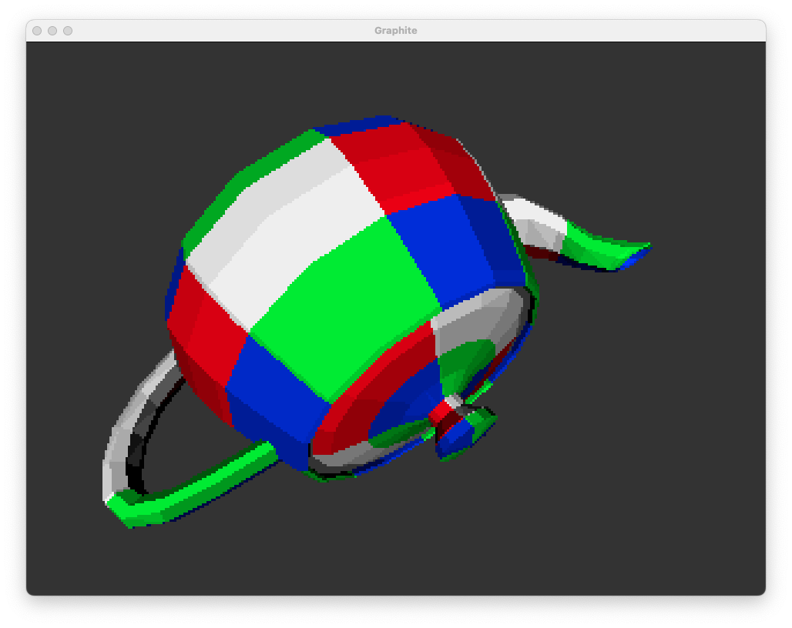

# Graphite

Graphite is a FPGA based open source system with 2D/3D graphics acceleration.

## Features

The system has the following features:

- RISC-V (RV32I + Graphite extension)
- UART (115200/230400-N-8-1)
- SDRAM (32MiB shared between CPU and video)
- Set associative cache (4-way with LRU replacement policy)
- 640x480 HDMI video output with framebuffer (ARGB4444)
- 2D/3D graphics accelerator (textured triangles)
- PS/2 keyboard
- PS/2 mouse
- SD Card with hardware SPI

## Requirements

- OSS CAD Suite (https://github.com/YosysHQ/oss-cad-suite-build) (*)
- xPack RISC-V Embedded GCC (https://github.com/xpack-dev-tools/riscv-none-elf-gcc-xpack/releases) (*)
- Python3 with the following PIP3 packages installed: `pyserial`
- SDL2 (for simulation only)

(*) Extract and add the `bin` directory to the path.

## Getting Started on ULX3S

```bash
cd soc/src/bios
make
cd ../../rtl/ulx3s
make prog
cd ../../src/examples/test_graphite
make run SERIAL=<serial device>
```

Open a serial terminal at 230400 bauds and press 'h' for help.

## System Simulation

```bash
cd soc/src/examples/test_video
make
cd ../../../../soc/rtl/sim
make run PROGRAM=../../src/examples/test_video/program.hex
```

## Graphics Accelerator Simulation



```bash
git clone https://github.com/danodus/graphite.git
cd graphite/rtl/sim
make run
```

- Press 1 to select the cube model;
- Press 2 to select the teapot model;
- Press W/A/S/D and arrows to move the camera;
- Press SPACE to start/stop the rotation of the model;
- Press TAB to enable/disable the wireframe mode;
- Press T to enable/disable texture mapping;
- Press L to increase the number of directional lights;
- Press G to enable/disable Gouraud shading.

## Acknowledgements

The SoC is based on the Oberon project for the ULX3S available here: https://github.com/emard/oberon.
The CPU is based on icicle v1 available here: https://github.com/grahamedgecombe/icicle/tree/v1
