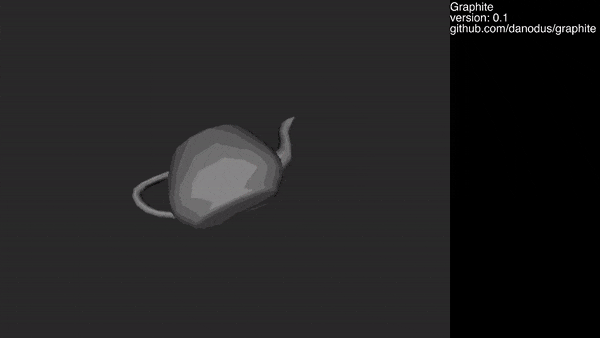

# Graphite

Graphite is a FPGA based open source system with 2D/3D graphics acceleration.



## Documentation

The documentation is available here: https://danodus.github.io/graphite/

## Features

The system has the following features:

- RISC-V (RV32IM)
- UART (2000000-N-8-1)
- SDRAM (32MiB shared between CPU and video)
- Set associative cache (4-way with LRU replacement policy)
- VGA (60 Hz), 480p (60Hz), 720p (60Hz) or 1080p (30Hz) HDMI video output with framebuffer (RGB565)
- 2D/3D graphics accelerator (textured triangles)
- PS/2 keyboard
- PS/2 mouse
- SD Card with hardware SPI

## Requirements

- OSS CAD Suite (https://github.com/YosysHQ/oss-cad-suite-build) (*)
- xPack RISC-V Embedded GCC (https://github.com/xpack-dev-tools/riscv-none-elf-gcc-xpack/releases) (*)
- Python3 with the following PIP3 packages installed: `pyserial`
- picocom
- SDL2 (for simulation only)

(*) Extract and add the `bin` directory to the path.

Note: Tested with `oss-cad-suite-darwin-arm64-20240810` and `xpack-riscv-none-elf-gcc-14.2.0-1-darwin-arm64`.

## Clone and Update

### Clone

```bash
git clone --recurse-submodules https://github.com/danodus/graphite.git
cd graphite
```

If the repository has been cloned without the `--recurse-submodules` option, do the following:
```
git submodule update --init
```

### Update

```bash
git pull
git submodule update --recursive
```


## Getting Started on ULX3S

```bash
cd soc/src/bios
make
cd ../../rtl/ulx3s
make clean;make VIDEO=<video mode> CPU_SPEED=<cpu speed> prog
cd ../../src/examples/test_graphite
make run SERIAL=<serial device>
picocom -b 2000000 <serial device>
```

and press 'h' for help.

The following video modes are available:
| Video Mode     | Description    |
| -------------- | ---------------|
| vga (default)  | 640x480 60Hz   |
| 480p           | 848x480 60Hz   |
| 720p           | 1280x720 60Hz  |
| 1080p          | 1920x1080 30Hz |

The following CPU speeds are available:
| CPU Speed      | Description |
| -------------- | ----------- |
| slow (default) | 40MHz       |
| fast           | 50MHz       |

## System Simulation

```bash
cd soc/src/examples/test_video
make
cd ../../../../soc/rtl/sim
make run PROGRAM=../../src/examples/test_video/program.hex
```

## Graphics Accelerator Simulation

```bash
cd rtl/sim
make run
```

- Press 1 to select the cube model;
- Press 2 to select the teapot model;
- Press W/A/S/D and arrows to move the camera;
- Press SPACE to start/stop the rotation of the model;
- Press TAB to enable/disable the wireframe mode;
- Press T to enable/disable texture mapping;
- Press L to increase the number of directional lights;
- Press G to enable/disable Gouraud shading.

## Acknowledgements

- The SoC is based on the Oberon project for the ULX3S available here: https://github.com/emard/oberon
